# API ISO27001

API construida en .NET que provee ciertos endpoints que demuestran de manera dinámica los controles de Política de control de acceso (A.9.1.1), registro y baja de usuarios (A.9.2.1), procedimientos seguros de inicio de sesión (A.9.4.2) y privilegios y restricciones de acceso (A.9.1.1 + A.9.2.3) provenientes de la norma ISO27001.

## Funcionamiento

Iniciaremos sesión como usario con rol de Gerente (Manager). Por medio de la cración de una política de autoriazción, este rol, junto con el de recursos humanos (HR) nos permitirá ver los salarios de los empleados de la compañia.

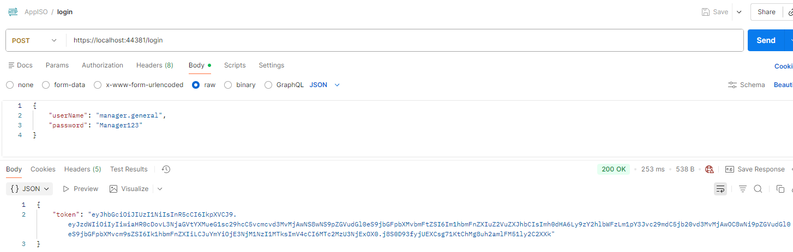

Como resultado obtendremos el token (JWT) de inicio de sesión, el cual internamente proveerá a la API nuestro rol y demás información la cual será útil para determinar a qué tenemos permiso.

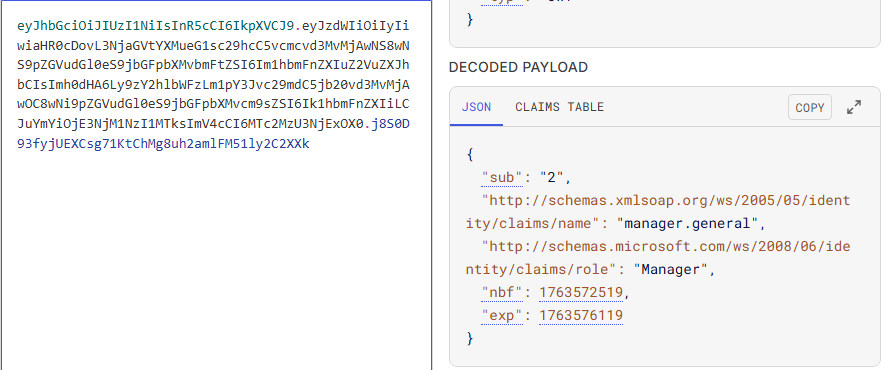

Al decodificar nuestro token veremos información importante, como nuestro usuario (manager.general) y asimismo nuestro rol en el sistema (Manager). Al usar este token de acceso para hacer la petición y obtener los salarios de los empleados nos retornará la información con éxito.

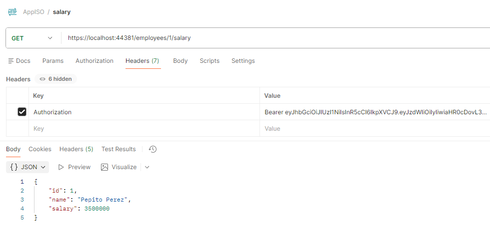

Por otro lado, si iniciamos sesión como Aministradores y usamos el token de acceso, por politicas, no podremos visualizar el salario y recibiremos un status de que no tenemos autorización.

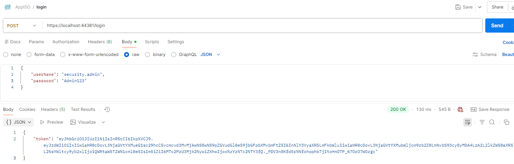

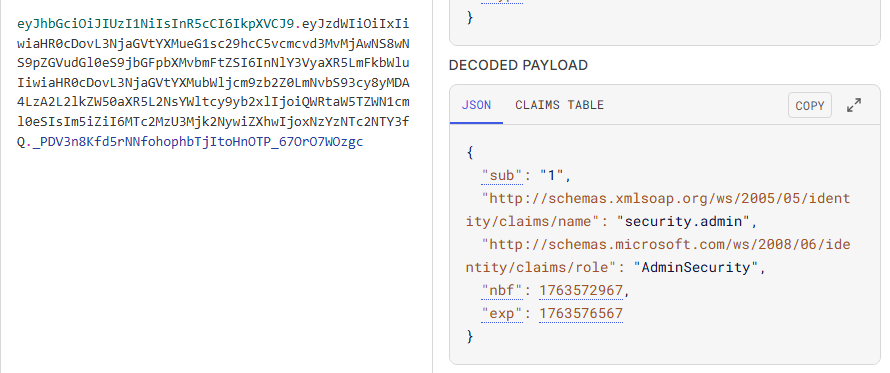

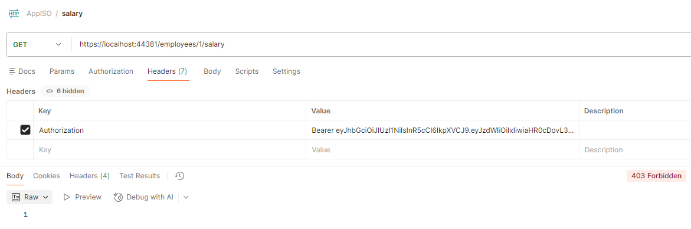

De igual forma, como Administradores podremos registrar y dar de baja a usuarios en la compañía por lo que al registrar un usuario con el token actual el resultado debe ser exitoso.

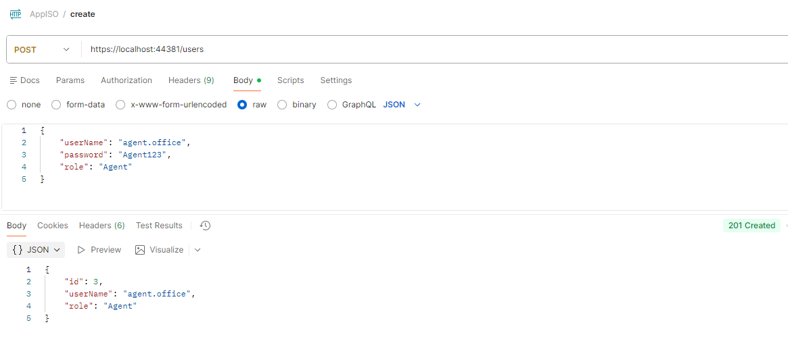

Asimismo, podremos inactivar el usuario que recien creamos.

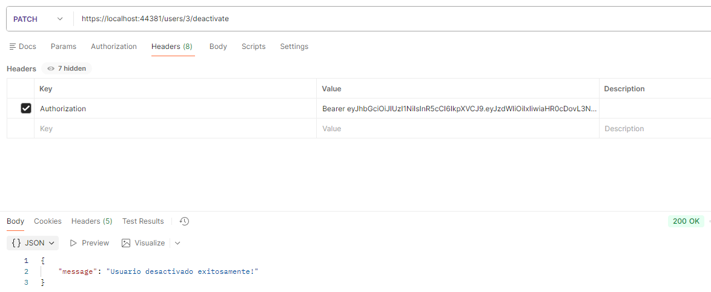

Por último, iniciaremos sesión con un usuario que no tenga permisos de creación e inactivación de usuarios, como puede ser un usuario con rol de HR o Manager, asi que usaremos nuevamente el usuario de la primera demostración.

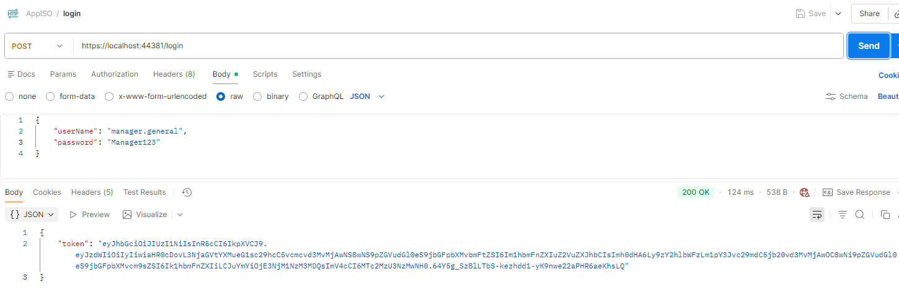

Al intentar registar un nuevo usuario o inactivar otro existente no se nos permitirá evidenciando que las políticas creadas cumplen con su trabajo.

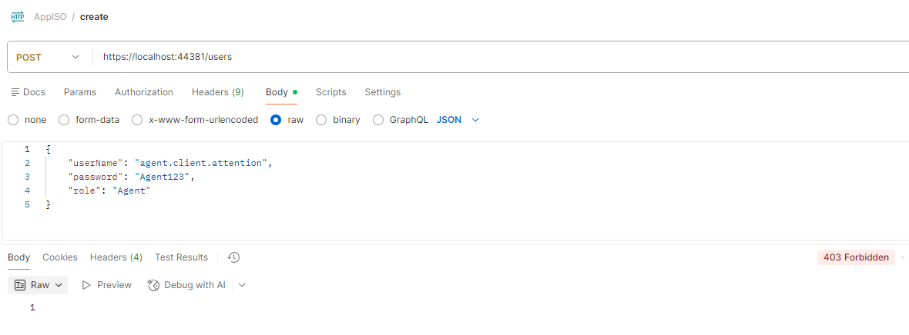

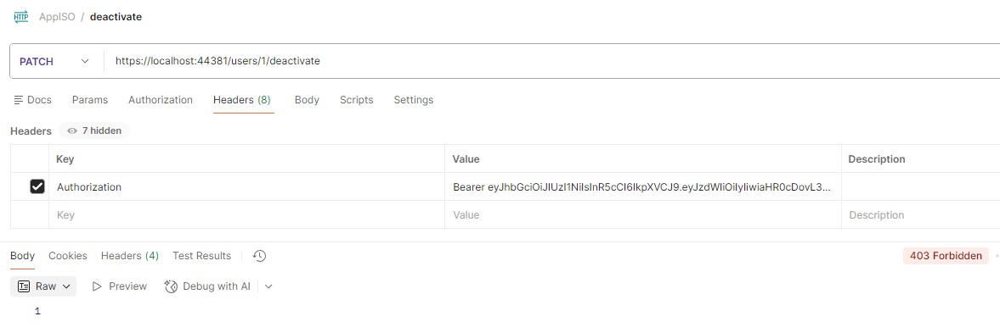

